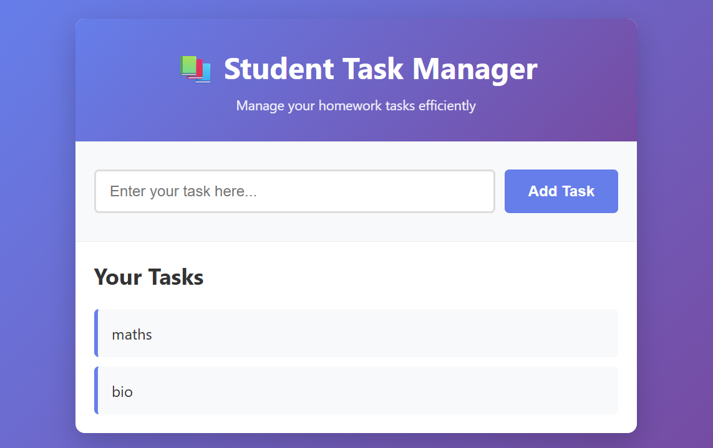
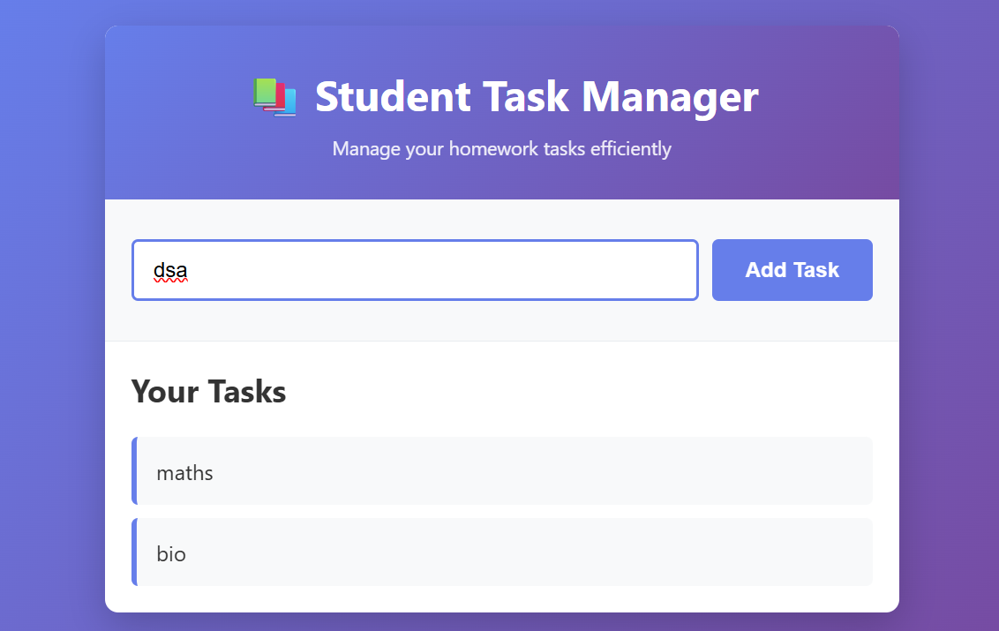
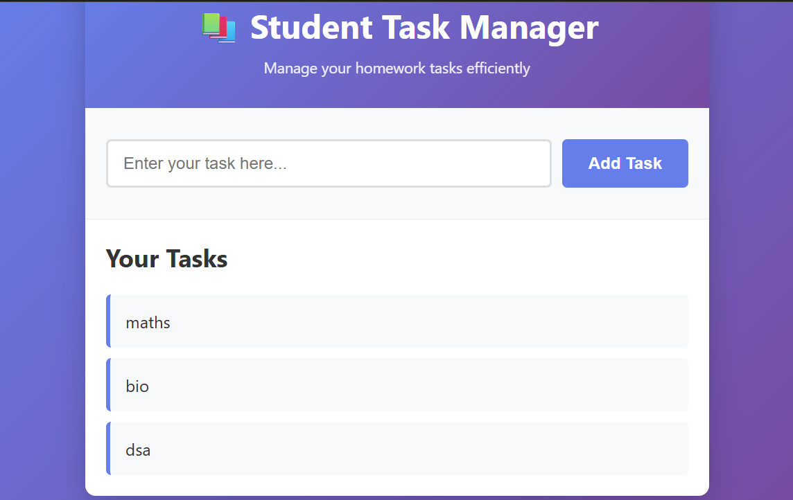

# 📚 Student Task Manager

## 1. Project Title & Goal

**Student Task Manager** is a simple full-stack Single Page Application (SPA) that lets students add homework tasks and view them in real time without refreshing the page. Tasks are stored in a local JSON file and served via a Node.js/Express API, with a vanilla HTML, CSS, and JavaScript frontend.

---

## 2. Setup Instructions

Run these commands from the **project root** (where `package.json` and `server.js` are located):

```bash
npm install
npm start
```

Then open your browser and go to:

```
http://localhost:3000
```

---

## 3. The Logic (How I Thought)

### Why did I choose this approach?

- **Node.js & Express.js** — I used them for the backend because they are simple and easy to manage.

- **Local JSON file** — Tasks are stored in a local JSON file, which satisfies the requirement of using local storage instead of a full database.

- **HTML, CSS & JavaScript** — The frontend is built using vanilla HTML, CSS, and JavaScript to keep the project simple and framework-free.

- **Fetch API** — I used the Fetch API so tasks can be added and displayed dynamically. The frontend talks to the backend without reloading the page.

- **Single Page Application (SPA)** — This makes the application a true SPA: the page does not refresh when adding or viewing tasks. All updates happen in the same view.

### What was the hardest bug I faced, and how did I fix it?

| | |
|---|---|
| **Bug** | Tasks were added to the JSON file, but they were not showing on the webpage. |
| **Cause** | The frontend was not reloading the updated task list after adding a new task. |
| **Fix** | After adding a task, I fetched the task list again from the backend and updated the DOM using JavaScript. This fixed the issue and tasks appeared immediately. |

---

## 4. Output Screenshots

The screenshots below prove that the application works correctly.

### Task list with 2 tasks (maths, bio)



### Adding a new task ("dsa")



### Task list with 3 added tasks (maths, bio, dsa)



---

## 5. Future Improvements

If I had **2 more days**, I would:

1. **Add a delete task option** — Allow users to remove tasks they no longer need.
2. **Allow users to mark tasks as completed** — Add checkboxes or a "done" state so users can track progress.
3. **Improve the UI using better CSS** — Refine layout, colors, and responsiveness for a cleaner look.
4. **Add basic user login support** — Simple authentication so each user can have their own task list.
